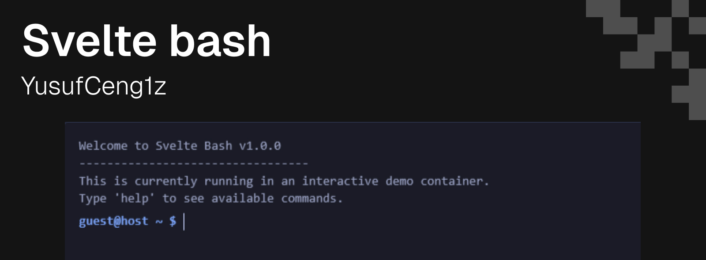

# Svelte Bash

<div align="center">

  

  <h1>Svelte Bash</h1>

  <p>
    <strong>The ultimate lightweight, fully typed, and customizable terminal component for Svelte 5.</strong>
  </p>

  <p>
    <a href="https://svelte-bash.netlify.app/"><strong>Live Demo</strong></a> ·
    <a href="https://www.npmjs.com/package/svelte-bash"><strong>NPM</strong></a> ·
    <a href="https://github.com/YusufCeng1z/svelte-bash"><strong>GitHub</strong></a>
  </p>

  <p>
    
    
    
    
  </p>

</div>

---

**Svelte Bash** is a high-performance terminal emulator component designed specifically for modern Svelte applications. It provides a realistic shell experience with a virtual file system, command history navigation, and advanced features like autoplay sequences for tutorials.

> **Note:** As of v1.0.1, svelte-bash has been refactored to use **Pure Vanilla CSS** internally. This means it has **ZERO dependencies** on Tailwind CSS and will render correctly in any project (including Bootstrap, Tailwind, or plain CSS projects). You do NOT need to install Tailwind.

Whether you are building a developer portfolio, a documentation site, or a web-based CLI tool, Svelte Bash offers the perfect balance of aesthetics and functionality.

## Key Features

*   **Lightweight & Fast**: Zero external dependencies, ~4kb gzipped.
*   **Virtual File System**: Fully functional `ls -la`, `cd`, `cat`, and `pwd` commands.
*   **Filesystem Mutation**: Create, move, copy, and delete files/folders (`mkdir`, `touch`, `rm`, `cp`, `mv`).
*   **Persistent State (v1.2)**: Built-in `persist` prop to automatically save/load state to `localStorage`.
*   **Advanced I/O (v1.2)**: Redirect command outputs to files using `>` and `>>`.
*   **Nano Text Editor (v1.2)**: Built-in GNU nano clone overlay (`nano <file>`) to edit files directly.
*   **Autoplay & Bootplay (v1.2)**: Script commands to run automatically, or stream fast non-interactive outputs (like boot logs). *(Bootplay credit: [@daemy](https://github.com/daemy))*
*   **ZSH Syntax Highlighting (v1.2)**: Live tokenization colors for commands, strings, and flags.
*   **Ghost Completion & Typewriter (v1.2)**: Premium visual interactions for a high-end CLI feel.
*   **Aliases**: Create custom command shortcuts (e.g. `alias ll='ls -la'`).
*   **Deep Theming**: Includes `dracula`, `matrix`, `dark`, and `light` presets, plus full CSS control.
*   **Accessible**: Proper focus management and keyboard history navigation (Up/Down arrows).
*   **TypeScript**: Written in TypeScript for excellent type safety and autocomplete.

## Installation

```bash
npm install svelte-bash
```

## Usage

### Basic Example

Import the component and pass a `structure` object to define the virtual file system.

```svelte
<script>
  import { Terminal } from 'svelte-bash';

  const fileSystem = {
    'readme.md': '# Hello World',
    'src': {
       'app.js': 'console.log("Hi")'
    }
  };
</script>

<Terminal
    structure={fileSystem}
    user="guest"
    style="height: 300px"
/>
```

### Filesystem Persistence (v1.2.0)

For simple apps, simply pass a string to the `persist` prop and the terminal will autosave the filesystem state to `localStorage` under that storage key:

```svelte
<Terminal
    structure={initialState}
    persist="my-local-storage-key"
/>
```

If you need programmatic control, you can still listen to `on:change`:

```svelte
<script>
    import { Terminal } from 'svelte-bash';

    function handleFsChange(event) {
        // event.detail contains the new FileStructure
        console.log("Filesystem changed:", event.detail);
    }
</script>

<Terminal
    structure={initialState}
    on:change={handleFsChange}
/>
```

### Advanced I/O and Text Editor (v1.2.0)

Svelte Bash now supports basic stream redirection (`>` and `>>`) out of the box. You can write the output of any command directly to a file:
```bash
$ ls -la > output.txt
$ cat output.txt
```

Need to edit files? Just type `nano <filename>` and you'll get a fully functional, zero-dependency GNU Nano GUI embedded right in the terminal space, allowing direct modifications to strings inside the virtual filesystem!

### Custom Commands & Aliases

You can extend the terminal with your own commands or presets.

```svelte
<script>
  import { Terminal } from 'svelte-bash';

  const myCommands = {
    // Return a string
    hello: () => "Hello form svelte-bash!",

    // Accept arguments
    echo: (args) => args.join(' '),

    // Define an alias programmatically
    ll: () => "alias ll='ls -la'"
  };
</script>

<Terminal commands={myCommands} />
```

### Premium Visuals & Effects (v1.2.0)

**Typewriter Welcome Messages:**
Instead of printing immediately, welcome messages can be animated character-by-character.
```svelte
<Terminal
    welcomeMessage={["Wake up, Neo..."]}
    typewriter={true} <!-- or {30} for typing speed -->
/>
```

**ZSH-Style Syntax Highlighting & Ghost Completion:**
Give your terminal that beloved Oh-My-Zsh feel. `syntaxHighlight` parses inputs to color valid commands green, invalid ones red, strings yellow, and flags blue. `ghostCompletion` predicts your next move.
```svelte
<Terminal
    syntaxHighlight={true}
    ghostCompletion={true}
/>
```

### Autoplay (Show Mode)

Perfect for documentation or presentations. The terminal will automatically type and execute the provided sequence.

```svelte
<Terminal
  autoplay={[
    { command: "mkdir project" },
    { command: "touch project/index.js", delayAfter: 500 },
    { command: "ls -la" }
  ]}
  typingSpeed={80}
/>
```

## Theming

Svelte Bash allows comprehensive styling customization.

**Built-in Presets:**
- `dark` (default)
- `light`
- `dracula`
- `matrix`

**Custom Theme Object:**

```svelte
<Terminal
  theme={{
    background: '#1a1b26',
    foreground: '#a9b1d6',
    prompt: '#7aa2f7',
    cursor: '#c0caf5'
  }}
/>
```

## API Reference

| Prop | Type | Default | Description |
|------|------|---------|-------------|
| `structure` | `FileStructure` | `{}` | Key-value pairs defining the virtual file system. |
| `commands` | `Record<string, Function>` | `{}` | Custom command handlers. |
| `theme` | `string` \| `Theme` | `'dark'` | Theme preset name or specific color object. |
| `user` | `string` | `'user'` | The username displayed in the prompt. |
| `promptStr` | `string` | `undefined` | Static override for the entire prompt. |
| `welcomeMessage` | `string` \| `string[]` | `[]` | Message shown on initialization. |
| `typewriter` | `boolean` \| `number` | `false` | Animate the welcome message character-by-character. |
| `syntaxHighlight`| `boolean` | `false` | Enable interactive ZSH-style tokenization. |
| `ghostCompletion`| `boolean` | `false` | Faint overlay predicting internal/external commands. |
| `persist` | `boolean` \| `string` | `undefined` | Key to sync the filesystem structurally with `localStorage`. |
| `autoplay` | `AutoplayItem[]` | `undefined` | Array of commands to execute automatically. |
| `bootplay` | `BootplayItem[]` | `undefined` | Fast, non-interactive initialization logs. |
| `typingSpeed` | `number` | `50` | Default typing speed for autoplay (ms). |
| `bootSpeed` | `number` | `10` | Default stream interval for bootplay logs (ms). |

### Events

| Event | Detail | Description |
|-------|--------|-------------|
| `change` | `FileStructure` | Fired when the filesystem is modified (mkdir, rm, etc). |

## Contributing

Contributions are welcome! Please feel free to submit a Pull Request.

## License

MIT © [Yusuf Cengiz](https://github.com/YusufCeng1z)
